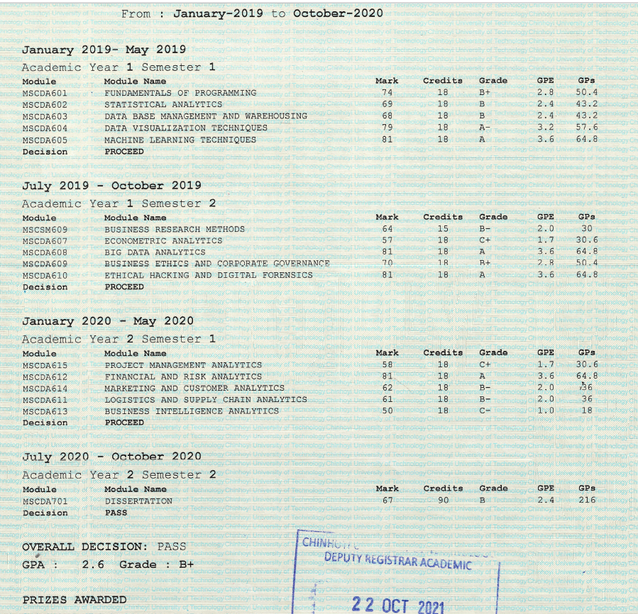

# My AI Adoption Journey - Strategy, Tips.

After about 10 years as an Infrastructure & Cloud professional, I'd worked with some remarkable technologies — Python, MongoDB, Linux, VMware, Cisco, Dell, AWS, Azure — validating my knowledge along the way through certifications like RHCE, Azure & AWS Solutions Architect. But something was missing. I wanted to reset my academic curious mind, get it back into a state where I could learn how to learn. Ambiguous right....

So just around Covid, I decided to enrol for an MSc. Now here's the thing — I already had experience as a Cloud Professional, and in my opinion, degrees in AI, CyberSecurity or Cloud Computing can quickly be superseded by industry progress, making them obsolete in a few years. What about the fundamentals you ask.... the shift in those spaces is too significant, I did not want to risk it. The next best thing? Data Engineering. As a field it has really matured over the years together with tools like Databricks, Azure Data Factory, AWS Redshift, and I decided this was going to be a good precursor to AI.

As someone who had done their 1st programme in Computer Science, most of the courses were a refresher. I mostly paid particular interest to 3 main areas:

- **Machine Learning Techniques** — Traditional ML + Deep Learning + feature engineering and the mechanics of tuning a model.
- **Statistical Analysis** — Basics of statistics required to understand mathematical and statistical models — regression, multivariate etc.
- **And My Major in Business** — this was the birth of investing in stock market.

Enter AI. Having done an MSc in Big Data, it turned out to be the right foundation to understand at a high level what was going on.

Just recently, AI has been more than a buzzword, and as an I.T professional, you have to take stock — where do I fit in whilst there is a big shift happening? What I discovered was simple: right now, AI — like robots — needs humans for end to end automation. My role was not to worry about the future but to figure out how I can adapt my experience and working style using AI workflows.

Fortunately for me, the organisation I joined quickly embraced AI tools such as Kiro & GitHub Copilot + Review. Ever since organisations enabled teams to adopt these tools as part of their workflows, one thing has remained clear — to build anything, you need context and knowledge. A human in the loop is still required to tackle things like security, verification, and all the stuff that keeps systems from falling apart.

Over time using AI, we realised that without context, everyone is just spending tokens to solve problems that could otherwise be solved by a re-usable workflow. Think about it — IaC & automation have been a significant pillar of DevOps practices for years. Each day you spend in an organisation is time you're gaining more context about your systems, your team processes, your domain.

As we evolved as a team, each one of us adopted these AI tools to improve productivity in various ways. In this repo, I'll be documenting my journey and trying to capture every bit of detail that will help someone out there understand the tradeoffs.

1st things first —

- I will look at AI with a cost, productivity, and practices lens.

# AI-Enabled Engineering & Workflow Automation

Improved delivery velocity by embedding AI-assisted workflows using GitHub Copilot, Kiro, and GitHub CLI across infrastructure delivery and operational support.

## Workflows

| Workflow | Description |
|----------|-------------|
| [Codebase & Architecture Analysis](CodebaseAnalysis.md) | Analyse codebases to identify boundaries and support decoupling decisions |
| [Infrastructure Delivery](InfrastructureDelivery.md) | AI-assisted SDLC from Jira task through to PR merge |
| [Planning & Kanban Decomposition](PlanningWorkflow.md) | Identify dependencies and split tasks for delivery clarity |
| [Incident Management](IncidentManagement.md) | AI-assisted incident analysis, validation, and remediation |
| [Documentation & Knowledge Discovery](DocumentationDiscovery.md) | Retrieve operational knowledge to reduce onboarding time |

## Tools

- **GitHub Copilot** — code review, implementation assistance
- **Kiro** — design/spec generation, incident analysis, MCP context integration
- **GitHub CLI** — PR creation, branch management
- **MCP Tools** — Jira, Confluence, and Terraform repo context
